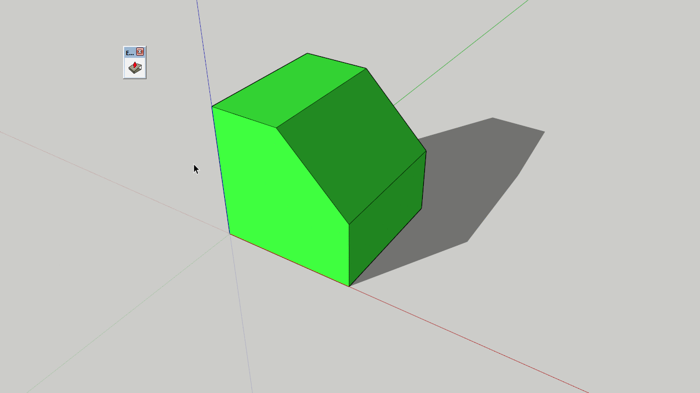

# FaceShader

This is an attempt to mimic SketchUp's own face shading to let custom Ruby Tools preview faces as if they have already been drawn.

(Example from Eneroth Align Face)

To use this class in your own plugin projects, copy face_shader.rb into your plugin's directory and replace the outer wrapper module with the module your plugin uses.
